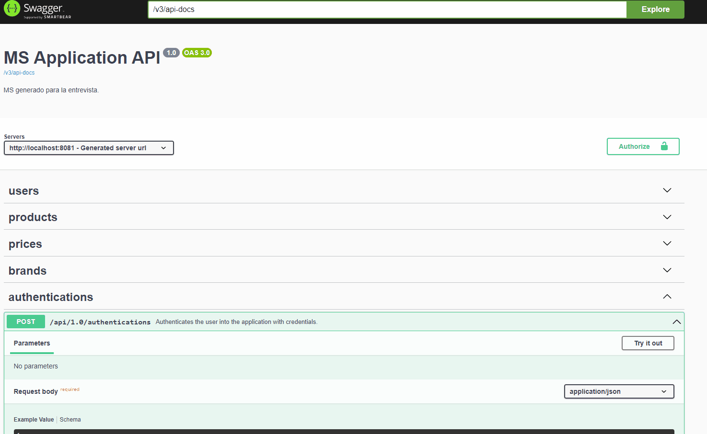
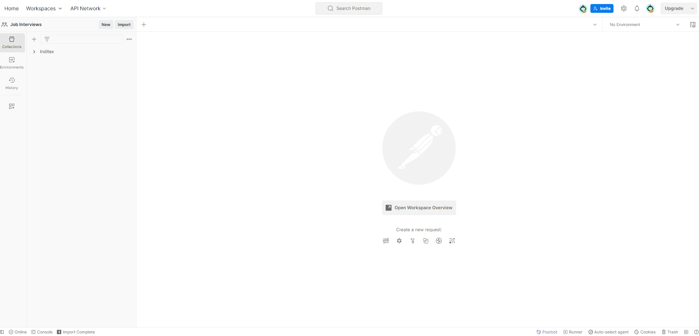

# Introducción

Este proyecto ha sido desarrollado en base a los requisitos descritos en la prueba de Inditex (TestJava2020). Además
del servicio requerido en la descripción, se ha incluido un CRUD básico para cada uno de los recursos, así como un
sistema básico de autenticación con Spring-Security, sin llegar a limitar accesos por rol, únicamente limitando el
acceso a usuarios autenticados.

El proyecto se compone de 3 módulos:

- commons: contiene utilidades y clases que pueden ser reutilizadas en distintos microservicios.
- commons-test: contiene utilidades y clases que pueden ser reutilizadas en distintos microservicios para la
  implementación de sus tests.
- inditex-ms: microservicio con arquitectura hexagonal que contiene la lógica solicitada en el ejercicio.

## Requerimientos

1. Java 17+
2. Maven 3.9.5+

## Configuración

1. El proyecto utiliza Lombok, que generará algunas piezas de código (constructores, getter, setters, builders, etc)
   por lo que será necesario habilitar el post-procesado o la instalación del plugin de lombok dependiendo
   del entorno de desarrollo donde se desee abrir el proyecto.

2. El proyecto utiliza QueryDsl, esta librería genera unas clases "QEntityName" que servirán para realizar consultas
   con filtros dinámicos. Para que el entorno de desarrollo las detecte tras la compilación del proyecto, habrá
   que añadir la ruta donde se generan en "/target" como "sources" en el proyecto.

3. El módulo "inditex-ms", depende del módulo "commons" y "commons-tests", en caso de dar error la dependencia, tendrá
   que realizar un maven install sobre estos módulos para que se instalen la dependencias en nuestro repositorio local
   de maven.

```bash
mvn install
```

# Pruebas

Tras arrancar el proyecto "inditex-ms", si todo va bien este levantará un API REST en la
dirección "http://localhost:8081/".

El proyecto incluye una interfaz Swagger para OpenApi 3, al abrir en un navegador la ruta mencionada previamente,
seremos redirigidos a esta interfaz.

## Datos

El proyecto utiliza una base de datos H2 que viene pre-inicializada con los datos indicados en el archivo "TestJava2020"
de Inditex, así como con 2 usuarios con distinto rol que podremos utilizar en nuestras pruebas.

| Username | Password |
|----------|----------|
| admin    | test     |
| user     | test     |

## Autenticación

Para poder probar los distintos servicios del API, primero deberemos autenticarnos con alguno de los 2 usuarios
disponibles. Para llevar a cabo esta acción, utlizaremos el servicio de autenticación que hay dispnible en el API.

| Swagger                                                      | Servicio                                      |
|--------------------------------------------------------------|-----------------------------------------------|
| http://localhost:8081/swagger-ui/index.html#/authentications | http://localhost:8081/api/1.0/authentications |

Este servicio es de tipo POST y requiere un body como el siguiente:

```mermaid
{
  "username": "admin",
  "password": "test"
}
```

Si la llamada es correcta, el sistema debería devolver una respuesta JSON con el nombre del usuario y un JWT. Este JWT
deberá ser copiado y pegado en el botón verde de la parte superior a la derecha que pone "Authorize". Tras esto, Swagger
enviará en todas las llamadas la cabecera "Authorization" con el valor "Bearer {{JWT}}" y se nos permitirá el acceso.



## Ejecución

En este punto, habiendo realizado la autenticación, ya deberíamos ser capaces de utilizar cualquier servicio disponible
en el API.

El servicio solicitado en el ejercicio "TestJava2020.txt" lo podremos encontrar en:

| Swagger                                                     | Servicio                                                                                  |
|-------------------------------------------------------------|-------------------------------------------------------------------------------------------|
| http://localhost:8081/swagger-ui/index.html#/prices/getWith | http://localhost:8081/api/1.0/prices/products/35455/brands/1/2020-12-14T10%3A00%3A00.000Z |

En swagger ya se nos da un ejemplo de los datos que podremos utilizar en la llamada, los cuales son válidos sacados de
los ejemplos del archivo "TestJava2020.txt".

Para este ejercicio no tenía muy claro si el objetivo era recuperar todos los precios con un rango válido de fechas para
la marca y producto indicados, o si por el contrario, al existir un parámetro "priority", sólo había que devolver el
valor con la prioridad más alta. Para mi implementación he tomado este segundo caso, ya que me parecía el más lógico al
existir este parámetro.

# Tests

El proyecto implementa distintos tipos de pruebas

## Unitarios

Comprueban el comportamiento de las clases de forma aislada.

```
inditex-ms/src/test
```

## Integración

Comprueban el comportamiento del código incluyendo la interacción entre las distintas clases que lo componen.

```
inditex-ms/src/it
```

En el test "es.dtr.job.interview.inditex.ms.adapter.in.price.PriceControllerIT" se podrán encontrar las pruebas de
recuperación de precios con los datos indicados en el archivo del ejercicio "TestJava2020.txt".

## Funcionales

Comprueban el correcto comportamiento de la aplicación desde sistemas externos. Para estas pruebas se ha utilizado
POSTMAN, dentro del directorio "_postman" del proyecto, se podrá encontrar la colección y el environment, que pueden ser
importados para replicar las pruebas.

A continuación se puede ver la ejecución de las pruebas programadas solicitadas en el ejercicio "TestJava2020.txt".



# Errores detectados

1. Debido a la inicialización de los datos con "data.sql", las secuencias quedan desincronizadas y la operación de crear
   nuevos registros con la operación CREATE del CRUD falla hasta alcanzar el valor que debiera tener.

   Este problema lo he resuelto actualizando el valor de la secuencia en el mismo "data.sql", pero por algún motivo, al
   actualizar el valor, la secuencia queda con valor negativo "-47", por lo que he tenido que incrementar el valor en "
   50 + nº de registros creados en data.sql" para que continue en su posición normal.

   Esto no es un problema que afecte a la funcionalidad de la aplicación, pero es un comportamiento extraño que conviene
   tener identificado.

2. Actualmente en el servicio UPDATE del CRUD, hay que enviar toda la información de la entidad, incluso la que no se
   quiera cambiar, esto no debería ser así, deberían enviarse sólo los datos a modificar. En futuras mejoras habría que
   implementar una lógica que recuperara la entidad existente y la fusionara con los cambios recibidos.

   Este error se ha resuelto para la entidad usuario, añadiendo el método merge a la entidad, la idea sería crear una
   interfaz o clase base con este método que se utilizara de forma genérica desde CrudService para el update.